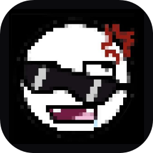
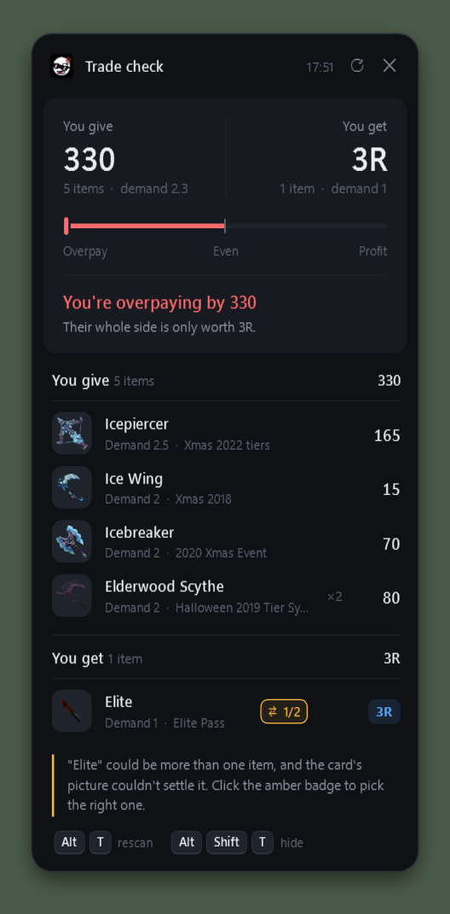
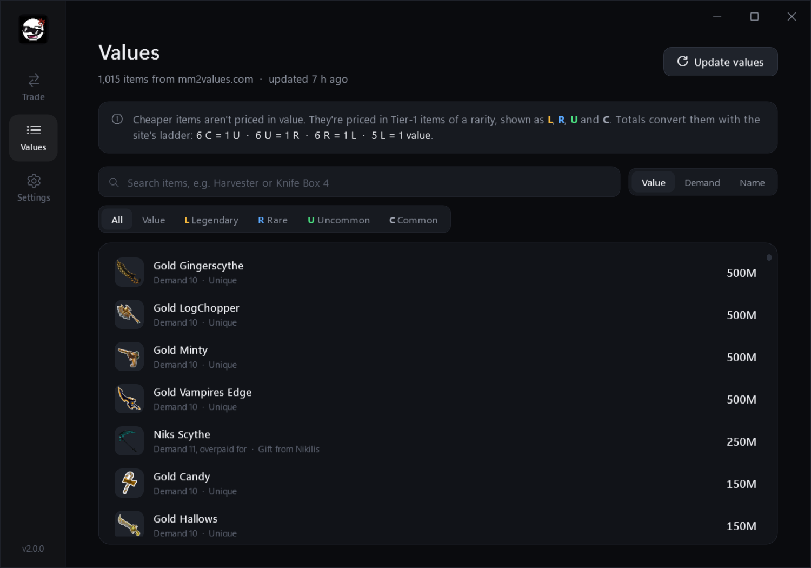
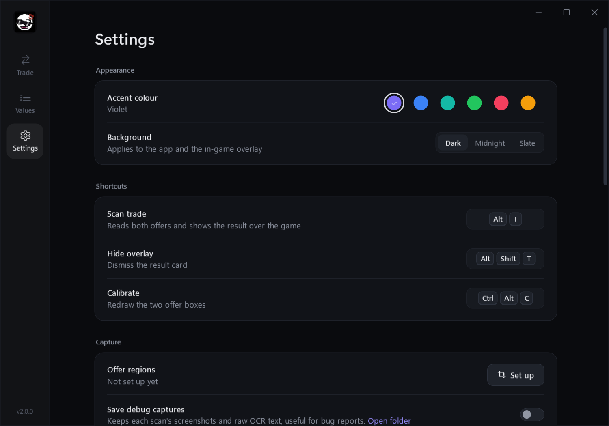
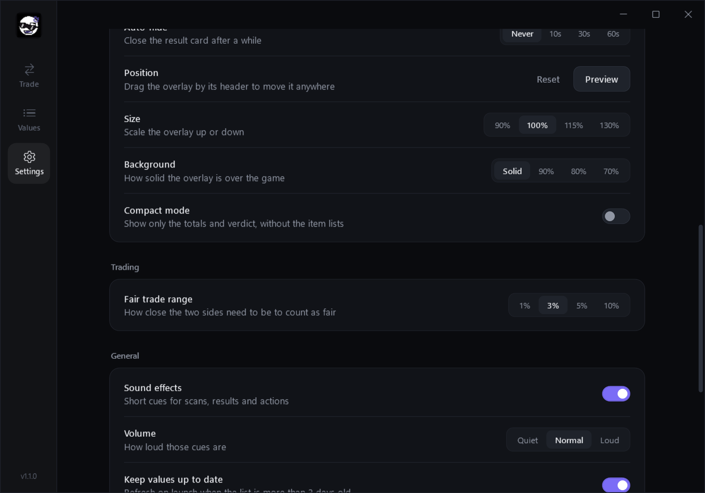

<p align="center">
  
</p>

<h1 align="center">MM2 Trade Overlay</h1>

<p align="center">
  Check a Murder Mystery 2 trade without leaving the game.<br>
  Press a key, and it reads both offers and tells you who comes out ahead.
</p>

<p align="center">
  <a href="https://github.com/DepravitiesFinest/MM2TradeOverlay/releases/latest">Download</a> ·
  <a href="#using-it">How to use</a> ·
  <a href="#building-from-source">Build it yourself</a>
</p>

<p align="center">
  
  &nbsp;
  
</p>

Created by **Hyper** ([@DepravitiesFinest](https://github.com/DepravitiesFinest)). Item values, demand ratings and item images come from [MM2Values.com](https://www.mm2values.com).

## What it does

When you're in a trade, press <kbd>Alt</kbd> + <kbd>T</kbd>. The app takes a screenshot of both offer boxes, reads every item name, looks up each value and shows a small card on top of the game with:

- what each side is worth, and how many items are on each side
- a balance scale showing whether you're overpaying, even, or making a profit
- the verdict in plain words, like "You're overpaying by 80"
- every item with its value, demand, origin and quantity
- a note when one side is in much higher demand than the other, since that decides how easy the items are to trade on

It works with the text recognition built into Windows, so there's nothing else to install. It never touches the Roblox client: no injecting, no memory reading, no account access. It only looks at your screen, the same as you do.

## Requirements

To run it:

- Windows 10 version 2004 (May 2020 update) or later, or Windows 11, 64-bit
- [.NET 8 Desktop Runtime (x64)](https://dotnet.microsoft.com/download/dotnet/8.0). Windows will point you to it the first time if it's missing.
- English text recognition. This comes with Windows when English is one of your languages. If it isn't, see [Troubleshooting](#troubleshooting).
- An internet connection the first time you update values or scan a new item with a shared name. A value list is built in, so it works offline after that.

Roblox can be windowed, maximised or fullscreen.

## Installing

1. Download `MM2TradeOverlay.exe` from the [latest release](https://github.com/DepravitiesFinest/MM2TradeOverlay/releases/latest).
2. Put it wherever you like, for example a folder in Documents.
3. Run it. Windows SmartScreen may warn about an unrecognised app the first time; click **More info** and then **Run anyway**. The full source is here if you'd rather build it yourself.

There's no installer. Settings, the downloaded value list and cached item images live in `%LOCALAPPDATA%\MM2TradeOverlay`. To remove the app completely, delete the exe and that folder.

## Using it

### First launch: set up the capture regions

The app needs to know where the two offer boxes are on your screen. You only do this once.

1. Open Murder Mystery 2 and start a trade with anyone, so both offer boxes are showing.
2. In the app, click **Start setup** on the Trade page, or press <kbd>Ctrl</kbd> + <kbd>Alt</kbd> + <kbd>C</kbd>.
3. The screen freezes with a dark tint. Drag a box around **your offer**: all four item slots, including the coloured name labels under the pictures.
4. Drag a second box around **their offer** the same way.
5. Click **Save regions** or press <kbd>Enter</kbd>.

Tips:

- A little extra space around the slots is fine. Cutting off the bottom of the name labels is not, because letters hanging below the line (g, y, p) can be misread.
- Right-click undoes the last box, and <kbd>Esc</kbd> cancels.
- The regions follow the Roblox window if you move it. If you change the window's size or your screen resolution, run the setup again.

### Checking a trade

Once both sides have put in their items, press <kbd>Alt</kbd> + <kbd>T</kbd>. The result appears on the right edge of the screen within a second or two. Press <kbd>Alt</kbd> + <kbd>Shift</kbd> + <kbd>T</kbd> to hide it, or click the X.

Reading the card from the top:

- **You give / You get** are the two totals, with the item count and each side's demand underneath.
- **The balance scale** tips left when you're overpaying and right when you're making a profit. The middle mark is an even trade.
- **The verdict** is written out, with a second line explaining it.
- **The item list** shows every item, its value, demand and origin. Quantities show as ×2, ×3 and so on.

The overlay never takes focus away from the game, doesn't show up in Alt+Tab, and can be dragged anywhere by its header. It remembers where you put it.

### How values are shown

Most items have a plain value, like 45. Cheaper items are priced on MM2Values in Tier-1 units of a rarity, and those show as coloured chips:

| Chip | Meaning |
| --- | --- |
| **L** | Tier-1 Legendary |
| **R** | Tier-1 Rare |
| **U** | Tier-1 Uncommon |
| **C** | Tier-1 Common |

So "4L" means the item is worth four Tier-1 Legendaries. Totals convert them using the same exchange rates as the MM2Values calculator: 6 C = 1 U, 6 U = 1 R, 6 R = 1 L, and 5 L = 1 value. Small totals are written the way traders say them, for example "1 + 4U".

A few items are listed on MM2Values at 0 because they haven't been priced yet. These count as one Common each, show as "~1C" and say "Not priced yet", so a pile of them still adds up.

### Demand

Every item shows its MM2Values demand rating. In practice this runs from 0 (nobody wants it) to about 7 for the most sought-after items; the Gold and Silver collector weapons sit at 10. If an item's stability isn't the usual "Stable" (for example "fluctuating" or "underpaid for"), that's shown next to it.

Each side's demand is weighted by value, so a 3,000-value godly counts for far more than a filler item. When the two sides differ by 1.5 or more, the verdict adds a note. Demand never changes the value totals.

### When the app isn't sure

A lot of MM2 items share a name. "Carrot" is a 2016 knife, a 2023 knife, and a 2024 gun and knife. For these, the app compares the picture on the card against each item's picture on MM2Values and picks the best match. Each card gets its own row, so two different "Carrot" items are never lumped together.

When the pictures are too close to call (usually re-releases with nearly identical art), the item gets an **amber badge** and a short note. Click the badge to switch between the possible items; hovering over it lists them all with their values. The same happens when a name could have been misread, for example "Elite" when the card might really say "Elitey".

If a quantity is ever read wrong, hover over the item: click the quantity to add one, or right-click to remove one. Totals and the verdict update straight away.

### The main window

**Trade** shows the last result in full, plus exactly what the scanner saw. Green boxes are items it recognised and amber boxes are text it couldn't match. If the picture doesn't show the offer boxes, run the setup again.

**Values** lists every item MM2Values tracks. Search by name or origin, filter by rarity unit, and sort by value, demand or name. **Update values** downloads the latest list, including demand; the app also does this on its own when the list is more than three days old.

**Settings** has:

| Setting | What it does |
| --- | --- |
| Accent colour, Background | Colours for the app and the overlay |
| Shortcuts | Click a shortcut, then press the new key combination |
| Offer regions | Re-run the capture setup |
| Save debug captures | Keeps the screenshots and text of every scan, for bug reports |
| Auto-hide | Closes the overlay after 10, 30 or 60 seconds |
| Position | Reset the overlay to its default spot, or preview it |
| Size, Background | Scale the overlay and make it more see-through |
| Compact mode | Only show totals and the verdict, without the item lists |
| Fair trade range | How close the sides must be to count as fair (default 3%) |
| Sound effects, Volume | Short sounds for scans and results |
| Keep values up to date | Refresh the list on launch when it's more than three days old |

<p align="center">
  
  &nbsp;
  
</p>

## Troubleshooting

| Problem | What to do |
| --- | --- |
| "Windows text recognition isn't installed" | Open Settings > Time & language > Language & region, add **English (United States)**, and restart the app. |
| "No items found" | Make sure the trade window is open, then look at "What the scanner saw" on the Trade page. If it doesn't show both offer boxes, run the setup again. |
| An item is read as something else | Click its badge to pick the right one if it has one. Otherwise, turn on **Save debug captures**, scan again and open an issue with that scan's folder. |
| A shortcut doesn't work | Another program is using it. The app will say so; pick a different one in Settings. |
| The overlay is off screen | Settings > Overlay > Reset. |
| A "window changed size" note | The Roblox window isn't the size it was during setup. Run the setup again. |

Bug reports are welcome on the [issue tracker](https://github.com/DepravitiesFinest/MM2TradeOverlay/issues). Please include the debug capture folder and `%LOCALAPPDATA%\MM2TradeOverlay\log.txt`.

## Building from source

You need:

- Windows 10 version 2004 or later, 64-bit
- [.NET 8 SDK](https://dotnet.microsoft.com/download/dotnet/8.0) (a newer SDK works too, as long as it can target .NET 8)
- Git
- Optional: Visual Studio 2022 17.8 or later, or JetBrains Rider, if you want an IDE

Clone and build:

```bash
git clone https://github.com/DepravitiesFinest/MM2TradeOverlay.git
cd MM2TradeOverlay
dotnet build -c Release
```

Run it straight from source:

```bash
dotnet run -c Release
```

Make a single-file exe like the one on the releases page (it needs the .NET 8 Desktop Runtime on the target PC):

```bash
dotnet publish -c Release -r win-x64 --self-contained false -p:PublishSingleFile=true -o publish
```

Or a larger exe that runs without .NET installed:

```bash
dotnet publish -c Release -r win-x64 --self-contained true -p:PublishSingleFile=true -p:IncludeNativeLibrariesForSelfExtract=true -o publish
```

The output is `publish\MM2TradeOverlay.exe`.

### Tests

The app has a built-in test run. It checks the value parsing and exchange maths, reads mock trade windows and real in-game screenshots from `Tests/Fixtures`, checks the picture matching for items that share a name, and renders screenshots of the interface:

```bash
MM2TradeOverlay.exe --selftest --ocr --screens --fixtures Tests\Fixtures --out selftest
```

Results go to `selftest\report.txt`. Other options:

| Option | What it does |
| --- | --- |
| `--fetch` | Downloads a fresh value list to `selftest\values.json` |
| `--sweep` | Checks the picture matching against every item that shares a name and reports the accuracy |

Each real screenshot in `Tests/Fixtures` has a `.txt` next to it listing the items it should find, one per line (`Chroma Cookiecane x1`). To add a regression test, crop the offer box from a screenshot and add the matching `.txt`. Cards whose label belongs to several items go in `Tests/Fixtures/lookalikes`, named after the label (`carrot_card_gun.png`), with the expected item written as `Name | Origin`.

To refresh the value list that ships inside the exe, run with `--fetch`, copy `selftest\values.json` over `Assets\values.json`, and rebuild.

### Project layout

| Folder | Contents |
| --- | --- |
| `Core` | Screen capture, image processing, OCR, item name matching, picture matching, quantities, hotkeys |
| `Data` | Settings, value list download and storage, item image cache |
| `UI` | Windows, pages, theme, overlay and view models |
| `Assets` | App icon and the built-in value list |
| `Tests/Fixtures` | Real trade screenshots used by the test run |

### How a scan works

1. Both offer boxes are captured, enlarged, and read twice by Windows OCR: once as they are, and once with only the white label text kept.
2. The text is split wherever there's a wide gap and matched against every item name, allowing for typical OCR slips like "rn" read as "m". Names that wrap onto two lines are joined back up, and the Chroma tag above a name is attached to it.
3. Quantity badges are only accepted where MM2 draws them, above an item's name on the right side of the card.
4. For names shared by several items, and for names that could be a misread of a longer one, the card's picture is compared with each candidate's picture from MM2Values.
5. Values are added up with the tier exchange rates, and the result goes to the overlay.

## FAQ

**Is it safe?** It captures the part of the screen you select and reads the text, and that's all. It doesn't read game memory, inject anything, or ask for your Roblox login, and all the source code is here to check.

**Can it get me banned?** It doesn't interact with Roblox in any way, it only looks at your screen. That said, it isn't an official Roblox tool, so use it at your own discretion.

**Where do the values come from?** MM2Values.com. The app downloads their public item pages when you click Update or when the list is more than three days old, and nothing more often than that.

**Why does an item show a different name than on the card?** MM2Values sometimes adds "Gun" or "Knife" to tell same-named items apart, like "Carrot Gun" for a card that says "Carrot".

## Credits

Made by **Hyper** ([github.com/DepravitiesFinest](https://github.com/DepravitiesFinest)).

Item values, demand ratings and item images come from [MM2Values.com](https://www.mm2values.com). This project isn't affiliated with Roblox, Nikilis or MM2Values.

## License

[MIT](LICENSE)
